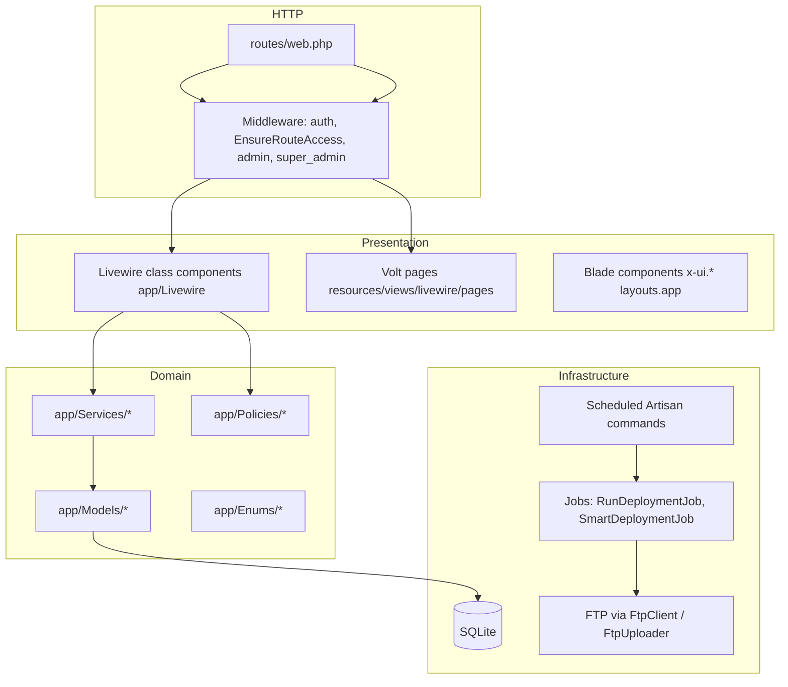

# PROJECT_KNOWLEDGE.md

> Compact architectural map for AI agents and developers. **Last verified:** 2026-10-08 via repository inspection (no application code modified).

## Purpose

Arabic-first **charity / case-management** web application for managing beneficiary families, social research, aid requests, field visits, donations/projects, and operational alerts. A separate **super-admin technical zone** handles releases, FTP/smart deployment, maintenance, and database backups (oriented toward shared hosting e.g. Hostinger / `charity.phantom-tech.site`).

**Not in scope (placeholders in nav/routes):** committees, generic assistance hub, opportunities, sponsorships, funds, programs, warehouses, notifications center, WhatsApp, tasks, complaints, reports, branches UI, reference data, audit log, and several other sidebar entries render `livewire.pages.placeholder`.

---

## Technology Stack

| Layer | Choice |
|--------|--------|
| Runtime | PHP 8.3+ (project targets 8.4 in guidelines) |
| Framework | Laravel 13 |
| UI | Livewire 4, Livewire Volt 1 (login + dashboard) |
| Client JS | Alpine.js 3 |
| CSS | Tailwind CSS 4 (`@theme`, CSS variables in `resources/css/app.css`) |
| Icons | `blade-ui-kit/blade-heroicons` |
| DB (default) | SQLite (`database/database.sqlite`; decision D001) |
| Queue / jobs | Database driver; `queue:work` scheduled every minute in `routes/console.php` |
| Session | Database |
| Build | Vite 8 |
| Tests | PHPUnit 12 (~49 feature test files under `tests/Feature/`) |
| Dev tooling | Laravel Boost, Pint, Pail, Herd (`.test` URL) |

**No separate REST API** for the charity app: HTTP is server-rendered Livewire + a few utility routes (`/health/ping`, `/media/{path}`, authenticated attachment download).

---

## High-Level Architecture

**Pattern:** Fat **service classes** for workflows (approval, delivery, re-assessment, deployment); **Livewire** owns UI state and calls services; **Navigation** + **EnsureRouteAccess** enforce menu-level authorization; **Policies** gate model actions (families, aid requests, visits).

---

## Directory Map (essential)

| Path | Role |
|------|------|
| `routes/web.php` | All web routes; Livewire full-page components |
| `routes/console.php` | Schedules: alerts, overdue visits, stale deployments, queue worker, DB backup |
| `bootstrap/app.php` | Middleware aliases `admin`, `super_admin` |
| `app/Livewire/` | Feature UI (Families, AidRequests, Visits, Delivery, Deployments, …) |
| `app/Livewire/Forms/` | `FamilyForm`, `AidRequestForm` |
| `app/Services/` | Business workflows (grouped by domain) |
| `app/Support/Navigation.php` | Sidebar groups, permissions, `canAccessRoute()` |
| `app/Support/Deployment/` | `ProjectSnapshot`, path guards for deploy pipeline |
| `app/Models/` | 33 Eloquent models |
| `app/Enums/` | Status/type enums (families, aid, visits, deployment, donations) |
| `app/Jobs/` | `RunDeploymentJob`, `SmartDeploymentJob` |
| `app/Console/Commands/` | `GenerateAlerts`, `DetectOverdueVisits`, `CleanupStaleDeployments`, `CreateDatabaseBackup` |
| `app/Http/Controllers/StorageFileController.php` | `/media/*` — public files without `public/storage` symlink |
| `resources/views/components/ui/` | Design-system Blade components |
| `resources/views/livewire/pages/` | Volt/page Blade views paired with Livewire |
| `resources/js/app.js` | Alpine, theme/preferences, progress bar |
| `lang/ar/ui.php`, `lang/ar/validation.php` | Arabic UI copy |
| `config/deployment.php`, `config/backup.php`, `config/governorates.php` | Deploy allowlists, backup retention, static reference data |
| `docs/` | Human docs: `PROGRESS.md`, `DECISIONS.md`, `UI_SYSTEM.md`, `DEPLOYMENT_SYSTEM.md`, `REASSESSMENT_AND_ALERTS.md`, etc. |

---

## Authentication & Authorization

### Auth

- Custom **Volt login** at `/login` (`resources/views/livewire/pages/login.blade.php`); no Breeze/Inertia (D002).
- Login identifier: **email or username** (`User::findForLogin()`).
- Logout: POST `/logout`.

### Roles (`users.role`)

| Role | Constant | Behavior |
|------|-----------|----------|
| Charity admin | `admin` | Full charity app; blocked from `super_admin` routes |
| Super admin | `super_admin` | Only technical sidebar; redirected to deployments; no charity stats |
| Fieldworker | `fieldworker` | Subset of routes via `fieldwork` nav group; data often scoped to linked `Fieldworker` |
| Staff user | `user` | Access via `menu_abilities` JSON array (per-route permissions from `Navigation::permissionOptions()`) |

### Enforcement layers

1. **`EnsureRouteAccess`** — `Navigation::canAccessRoute()` on every authenticated route (403 if menu/route not allowed).
2. **`EnsureAdmin` / `EnsureSuperAdmin`** — legacy/extra guards on deployment-related Livewire (super-admin routes use `super_admin` middleware on `/superadmin-dashboard/*`).
3. **Policies** — `FamilyPolicy`, `AidRequestPolicy`, `VisitPolicy` (Laravel auto-discovery).
4. **Fieldworker ownership** — e.g. `FamilyPolicy::ownsFamily()` ties records to `families.fieldworker_id`.

**Seeded accounts** (`DatabaseSeeder`): `admin`, `superadmin`, `agent` (fieldworker) — default password `password` (change in production).

---

## Core Business Domains & Workflows

### 1. Families / social research (case file)

- **Model:** `Family` — route key `case_number` (bigint), soft deletes, status enum `FamilyStatus`.
- **Related data:** members, income, resources, burdens, housing, aids (`FamilyAid`), status history, optional `fieldworker_id`.
- **Workflow:** Create/edit (multi-tab Livewire + `FamilyForm`) → submit → admin **review** (`FamilyReviewShow`, `FamilyApprovalService`: approve / reject / return for completion) → **approved** families eligible for aid and re-assessment.
- **Audit:** `created_by`, `updated_by`, approval/rejection timestamps and actors.
- **Key services:** `FamilyApprovalService`, `FamilyNumberGenerator`, `ReAssessmentService`.
- **Re-assessment (D007):** `family_assessments` rounds; `current_assessment_id`; sub-tables keyed by `family_assessment_id`; pages `ReAssessmentIndex`, `AssessmentHistory`.
- **Research listing:** `ResearchIndex` / `SocialResearch` model (parallel track to families).

### 2. Aid requests

- **Models:** `AidRequest`, `AidRequestItem`, `AidRequestAttachment`, `AidRequestStatusHistory`.
- **Status machine:** `AidRequestStatus` (draft → review states → approved/partial → `in_execution` → `pending_delivery_review` → `delivered` → `completed`).
- **Workflow:** Fieldworker/admin creates request with line items → submission/review → `AidRequestApprovalService` approves per-item → execution/delivery phases.
- **Numbers:** `AidRequestNumberGenerator`; sequences table for atomic counters.
- **Attachments:** stored under storage; download route resolves authorized access.

### 3. Delivery / execution

- **UI:** `App\Livewire\Delivery\DeliveryIndex` at `/delivery` (implemented with tabs: ready / in progress / delivered, file uploads, costs).
- **Service:** `DeliveryService` coordinates status transitions and item-level delivery fields (`delivered`, `delivery_date`, `actual_cost`, etc.).
- **Note:** `docs/PROGRESS.md` Phase 17 still describes `/delivery` as placeholder — **implementation exists**; treat PROGRESS as partially stale.

### 4. Visits

- **Model:** `Visit` with scheduling, execution, geo fields, `VisitStatus`, `is_overdue`.
- **UI:** index, create, edit, show, calendar, execute.
- **Services:** `VisitService`, `VisitNumberGenerator`.
- **Scheduled:** `app:detect-overdue-visits` hourly → `DetectOverdueVisits`.

### 5. Projects & donations

- **Models:** `Project`, `ProjectPhase`, `Donor`, `Donation` with enums `ProjectStatus`, `DonorType`, `DonationType`, `DonationMethod`.
- **UI:** CRUD/list Livewire under `/projects`, `/donors`, `/donations`.

### 6. Alerts & system settings

- **Settings:** `system_settings` key/value/types — `SystemSetting::get()` / `set()`; UI `SettingsIndex` (e.g. re-assessment interval months).
- **Alerts:** polymorphic `alerts` (`alertable_type`/`alertable_id`, D008); `ReAssessmentAlertService`; daily `app:generate-alerts` at 02:00; UI `AlertsIndex`; sidebar badges via shared Livewire stats (`ReAssessmentAlertsStat`, `NewAidRequestsStat`, `PendingApprovalsStat`).
- **User-targeted alerts:** `notified_user_id` on alerts; approval services create fieldworker notifications.

### 7. Organization & users

- **Organization:** `OrganizationIndex` (institution settings; seeded via `OrganizationSettingsSeeder`).
- **Users:** `UsersIndex` — roles and `menu_abilities` for `user` role.
- **Fieldworkers:** `Fieldworker` linked to `User`; admin index/show.

### 8. Super-admin: deployment & backups

Isolated at **`/superadmin-dashboard`** (route names still `deployments.*`, `backups.*`).

| Concern | Implementation |
|---------|----------------|
| Releases | `Release`, `ReleaseChange`, `ReleaseService`, snapshot `file_snapshot` JSON |
| Deploy runs | `Deployment`, `DeploymentStep`, `DeploymentService`, `RunDeploymentJob` |
| Safety | `DeploymentPathGuard`, `DeploymentProcessRunner` (command allowlist, secret redaction, output cap) |
| Config | `config/deployment.php` environments + allowlisted commands |
| FTP | `FtpClient`, `FtpUploader`, `DeploymentFtpSettings` (DB `deployment_settings`) |
| Smart deploy | `SmartDeployment`, `SmartDeploymentService`, `SmartDeploymentJob` |
| Package ZIP | `UploadPackageService`, `ProjectSnapshot::changesSince()` |
| Maintenance | Livewire maintenance page |
| Backups | `DatabaseBackup`, `DatabaseBackupService`, daily `app:database-backup` |
| Cleanup | `app:cleanup-stale-deployments` every 5 minutes |

Charity **admin** must not access these routes (403); super-admin does not see charity modules.

---

## Database Entity Overview

**Identity & prefs:** `users`, `user_preferences`

**Case management:** `families`, `family_members`, `family_income_sources`, `family_resources`, `family_burdens`, `family_housing`, `family_aids`, `family_status_histories`, `family_assessments`, `social_researches`, `fieldworkers`, `branches`

**Aid:** `aid_requests`, `aid_request_items`, `aid_request_attachments`, `aid_request_status_histories`

**Visits:** `visits`, `visit_status_histories`

**Fundraising:** `projects`, `project_phases`, `donors`, `donations`

**Ops:** `system_settings`, `alerts`, `sequences`

**Deploy tech:** `releases`, `release_changes`, `deployments`, `deployment_steps`, `deployment_settings`, `deployment_allowed_paths`, `smart_deployments`, `database_backups`

**Laravel:** `jobs`, `cache`, `sessions` (per migrations)

**Relationships (critical):**

- `Family` 1—N members/income/…; N—1 `fieldworker`; 1—N `aidRequests`, `visits`; belongs to current `FamilyAssessment`.
- `AidRequest` N—1 `Family`; 1—N items/attachments/histories.
- `Visit` N—1 `Family`, optional `aid_request_id`, `research_id`.
- `Alert` morphTo `alertable`; optional `notified_user_id`.
- `Fieldworker` 1—1 `User`.

---

## HTTP Entry Points (summary)

| Route pattern | Handler |
|---------------|---------|
| `/login` | Volt login (guest) |
| `/`, `/dashboard` | Volt dashboard |
| `/families/*` | Family Livewire suite |
| `/aid-requests/*` | Aid request Livewire |
| `/visits/*` | Visit Livewire |
| `/delivery` | `DeliveryIndex` |
| `/research` | `ResearchIndex` |
| `/projects`, `/donors`, `/donations` | Fundraising Livewire |
| `/organization`, `/users`, `/settings`, `/alerts` | Admin Livewire |
| `/fieldworkers/*` | Fieldworker admin |
| `/superadmin-dashboard/*` | Deploy + backups (super_admin) |
| `/media/{path}` | `StorageFileController` |
| `/health/ping` | 204 health |
| `/up` | Laravel health (bootstrap) |

Authenticated group: `middleware(['auth', EnsureRouteAccess::class])`.

---

## Frontend / UX Conventions

- **RTL Arabic** UI; Tajawal font (D005); locale/copy in `lang/ar/ui.php`.
- **Theming:** `UserPreference` (accent, density, font size, sidebar, reduced motion) persisted server-side + applied via `resources/js/app.js` (`applyPreferences`, Livewire events).
- **Components:** `<x-ui.*>` and `<x-layout.*>` (D006); see `docs/COMPONENTS.md`, `docs/UI_SYSTEM.md`.
- **Layout:** `resources/views/layouts/app.blade.php` — sidebar, top bar, stats widgets (hidden for super-admin).

---

## Background Processing & Schedules

| Schedule | Command |
|----------|---------|
| Daily 02:00 | `app:generate-alerts` |
| Hourly | `app:detect-overdue-visits` |
| Every 5 min | `app:cleanup-stale-deployments` |
| Every minute | `queue:work --stop-when-empty` (overlap protected) |
| Daily 03:00 (config) | `app:database-backup` |

Jobs: deployment pipelines on database queue; overlapping protection on deployment jobs.

---

## External Integrations

| Integration | Status |
|-------------|--------|
| FTP (deployment target) | Implemented; credentials in DB + `config/deployment.php` |
| Email / SMS / WhatsApp | Not implemented (nav placeholders) |
| Payment gateways | Not present |

---

## Production / Shared Hosting Constraints

(From `.agents/skills/shared-hosting-deployment` and `StorageFileController`.)

- **`exec()` / `symlink()` often disabled** — use `/media/{path}` instead of `public/storage` symlink.
- **Deployment system** designed for FTP upload + remote `migrate`/`cache` allowlist.
- **APP_URL** and asset URL generation matter for mixed environments; see deployment docs.

---

## Architectural Decisions (index)

See `docs/DECISIONS.md` for full text. Highlights: SQLite default, custom Livewire auth, Alpine for micro-interactions, Tailwind v4 tokens, assessment versioning (D007), polymorphic alerts (D008), runtime settings table (D009), scheduled alert generation (D010), super-admin split (Phase 21 in `PROGRESS.md`).

---

## Testing Map

Feature tests grouped by domain under `tests/Feature/`:

- Auth/UI shell, families, aid requests (incl. approval, delivery), visits, research, donations, projects, users, organization, alerts/stats, storage serving, backups, deployments (large suite).

**Convention:** PHPUnit only; run `php artisan test --compact` or filtered paths after changes.

---

## Change Impact Guide

| If you change… | Also check… |
|----------------|-------------|
| `Navigation::groups()` | `EnsureRouteAccess`, `UsersIndex` permissions, feature tests for access |
| Family assessment schema | `ReAssessmentService`, all `family_*` tables with `family_assessment_id`, alert generation |
| `AidRequestStatus` enum | Migrations history tables, `DeliveryIndex`, `DeliveryService`, approval service |
| Deployment allowlists | `config/deployment.php`, `DeploymentProcessRunner`, deployment tests |
| Public file URLs | `StorageFileController`, Blade `Storage::url` / custom media helpers, `StorageFileServingTest` |
| Scheduled commands | `routes/console.php`, server cron on production (scheduler) |

---

## Known Issues / Unverified

- **Doc drift:** `PROGRESS.md` Phase 17 (delivery placeholder) vs live `DeliveryIndex`.
- **`Role` enum** lists admin/fieldworker/user only; `super_admin` exists on `User` model but not in `App\Enums\Role`.
- **Placeholder routes** in `web.php` — no backend yet; sidebar may still show links for admins.
- **Exact test count** not re-run during this discovery (PROGRESS cites 225+ at an older date).
- **Production DB** may differ from SQLite in dev; schema is migration-driven but engine-specific enums were adjusted in places (aid request migrations).
- **`migrate:fresh`** warning in PROGRESS: `releases.file_snapshot` is large; avoid fresh without reason.

---

## Quick File Index for Common Tasks

| Task | Start here |
|------|------------|
| Add charity page | `Navigation.php`, `routes/web.php`, new `app/Livewire/...`, view under `resources/views/livewire/pages/` |
| Family approval logic | `FamilyApprovalService`, `FamilyReviewShow`, `FamilyPolicy` |
| Aid approval | `AidRequestApprovalService`, `ShowAidRequest` |
| Delivery flow | `DeliveryService`, `DeliveryIndex` |
| Re-assessment | `ReAssessmentService`, `docs/REASSESSMENT_AND_ALERTS.md` |
| Deploy release | `ReleaseService`, `Deployments/*` Livewire, `RunDeploymentJob` |
| Permissions bug | `Navigation::canAccessRoute`, `User::canAccessMenu` |
| Arabic copy | `lang/ar/ui.php` |
| UI component | `resources/views/components/ui/` |

---

## Related Documentation

Prefer updating this file when architecture shifts; detailed narratives remain in `docs/PROGRESS.md`, `docs/DECISIONS.md`, `docs/DEPLOYMENT_SYSTEM.md`, `docs/REASSESSMENT_AND_ALERTS.md`, `docs/UI_SYSTEM.md`.
